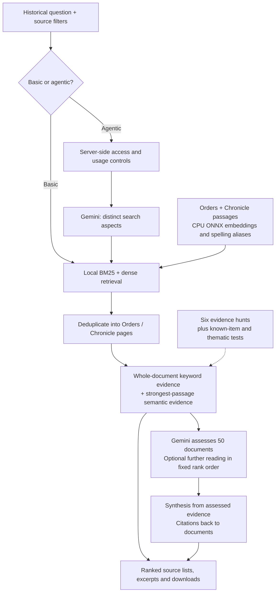

# SearchSpider

**Agentic retrieval for Konbaung historical documents.**

English search across Than Tun's *Royal Orders of Burma* (Parts 3–9) and the *Konbaungset Yazawin* chronicle (volumes 1–3), combining local hybrid retrieval with a Gemini research workflow that plans searches, assesses evidence and writes source-linked answers.

I built SearchSpider to help historians assemble evidence across a large, uneven archive: royal labour, hydraulic works, money and debt, captive populations, diplomacy and kingship. The engineering addresses a general document-search problem: retrieve broadly, rank the evidence that a bounded model budget can actually read, and preserve the route back to each source.

**[Live application](https://burmeseneuralreader.com/searchspider/)** · [Evaluation results](research/README.md)

## From a question to inspectable evidence

Basic search uses server-side hybrid retrieval without an LLM call. Agentic search uses the same retrieval engine and adds planning, assessment and synthesis. Additional reading works down the initial ranking; it does not issue another set of search queries. Burmese source text remains readable, while query retrieval is currently English only.

## Measured results

The main evaluation is six **evidence hunts**: broad research questions (labour, water
management, money and credit, captives and displacement, diplomacy, and royal
consecration), each with a reference list of every relevant document in the
collection, 2,067 question–document pairs in all, some topics with more than 500
documents. The hunts measure what matters for research use: how much of the relevant
evidence the system finds, and how early it ranks it. I used them to tune the ranking
and reading depth.

| Evidence hunts (6 questions, 2,067 reference documents) | Result |
|---|---|
| Reference documents found in the candidate pool | **1,995 (96.5%)** |
| Reference documents among the first 50 ranked per question (the first reading batch) | **234 of 300 slots (78.0%)** |
| Reference documents in the top 100 / top 250 per question | **408 / 781** |

Evaluation also shaped the architecture. Reading further down the existing ranking
recovered **173 additional reference documents**, against **153** from another round of
query generation, so the application reads deeper instead of re-querying. CPU
cross-encoder reranking added latency without improving recovery, so the deployed
pipeline uses **hybrid ranking with continued reading**.

Two narrower tests are also reported:

| Test | Result |
|---|---|
| Known-item retrieval: 691 questions, each written from one passage | **Hit@10 92.6%, MRR 0.814** (95.7% at page level) |
| Thematic retrieval: 48 questions, top ten graded | **nDCG@5 0.781 / 0.758**, Orders / Chronicle |

Details, per-question results and the reference lists are in [research/](research/README.md).

## Engineering highlights

- **Hybrid retrieval on CPU:** English stemming, sparse BM25, quantized multilingual-e5 embeddings through ONNX Runtime, alias expansion for candidate discovery, document deduplication and source-specific normalization.
- **Budgeted agent orchestration:** structured query planning, batched evidence assessment, bounded reading rounds, cited synthesis, follow-up questions and deeper reading for authorized access.
- **Evidence remains inspectable:** the complete retrieved pool, source identifiers, representative passages, model verdicts, ranking settings and usage metadata survive into the interface and downloads.
- **Evaluation-led simplification:** query replanning, graph gathering and cross-encoder reranking were tested; features were retained or removed according to measured evidence, runtime cost and implementation reliability.
- **Deployed application:** FastAPI backend, React/TypeScript interface, local corpus and embedding indexes, source filters, an inspectable search trail and regression tests.

The archive-specific pieces are the document adapters, historical names and evaluation questions. Hybrid search, query planning, evidence selection, provider integration, cost controls and ranked-list evaluation transfer to enterprise search, research assistance and document intelligence.

## Explore the code and evidence

| Area | Starting point |
|---|---|
| Candidate retrieval and hybrid ranking | [backend/search.py](backend/search.py), [backend/search_settings.py](backend/search_settings.py) |
| Planning, assessment, synthesis and continued reading | [backend/dossier.py](backend/dossier.py), [Gemini client](backend/spider.py) |
| HTTP service and access control | [backend/app.py](backend/app.py) |
| Account access and usage limits | [backend/access.py](backend/access.py), [Language Engine account bridge](deploy/language_engine/) |
| Browser experience | [frontend/src/](frontend/src/) |
| Corpus preparation and CPU embeddings | [scripts/](scripts/), [backend/corpus.py](backend/corpus.py), [backend/embed.py](backend/embed.py) |
| Regression coverage | [tests/](tests/) |
| Evaluation and model-selection decisions | [research/README.md](research/README.md), [research/evaluation/](research/evaluation/) |

## Data and models

The collection combines Than Tun's *Royal Orders of Burma*, Parts 3–9, and the three
volumes of the *Konbaungset Yazawin*. Search runs over English text; the Burmese text
is kept for reading. The book texts, model weights, production databases and API keys
are not included in this repository. The source works, translations and upstream
models keep their own rights and terms.

Passage embeddings use a quantized ONNX export of
[intfloat/multilingual-e5-small](https://huggingface.co/intfloat/multilingual-e5-small)
([Xenova export](https://huggingface.co/Xenova/multilingual-e5-small)); no model was
trained for this project. English stemming uses Snowball (Porter2) and the stopword list
is Apache Lucene's `EnglishAnalyzer`. See [THIRD_PARTY.md](THIRD_PARTY.md).
