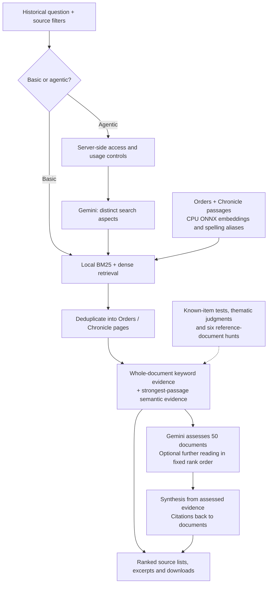

# SearchSpider

**Agentic retrieval for Konbaung historical documents.**

English search across Than Tun's *Royal Orders of Burma* (Parts 3–9) and the *Konbaungset Yazawin* chronicle (volumes 1–3), combining local hybrid retrieval with a Gemini research workflow that plans searches, assesses evidence and writes source-linked answers.

I built SearchSpider to help historians assemble evidence across a large, uneven archive: royal labour, hydraulic works, money and debt, captive populations, diplomacy and kingship. The engineering addresses a general document-search problem: retrieve broadly, rank the evidence that a bounded model budget can actually read, and preserve the route back to each source.

**[Live application](https://burmeseneuralreader.com/searchspider/)** · [Evaluation results](research/README.md)

## From a question to inspectable evidence

Basic search uses server-side hybrid retrieval without an LLM call. Agentic search uses the same retrieval engine and adds planning, assessment and synthesis. Additional reading works down the initial ranking; it does not issue another set of search queries. Burmese source text remains readable, while query retrieval is currently English only.

## Measured results

I evaluated **document finding and evidence collection** through targeted questions, broader thematic questions and six multi-query evidence hunts. The results measure both document recovery and placement in the ranked results.

| Evaluation | Scope | Result |
|---|---|---|
| **Targeted known-item retrieval** | 691 English test questions; exact Order or Chronicle sentence | **Hit@10 92.6%, MRR 0.814**; Hit@1 74.8%, Hit@5 89.7% |
| **Document-level targeted retrieval** | Same questions, accepting the target Chronicle page | **Hit@10 95.7%, MRR 0.839** |
| **Broader thematic retrieval** | 48 questions; fixed 46 Order / 47 Chronicle question-source pairs; fully judged top ten | **nDCG@5 0.781 / 0.758** and weighted **P@5 75.9% / 74.5%**, Orders / Chronicle sentences |
| **Six-topic evidence recovery** | 2,067 preselected positive question-document pairs | **1,995 recovered (96.5%)** in full candidate pools; **234/300 (78.0%)** known positives among the first 50 documents per topic |
| **Evidence deeper in the ranking** | Same six fixed initial rankings | **408/600** known positives at top 100 per topic; **781/1,500** at top 250 |

In the six-topic evidence hunt, SearchSpider recovered **1,995 of 2,067 marked question-document pairs** and placed **234 reference matches in the first 300 assessment slots**. This tests the complete evidence-gathering workflow: finding the designated material, ranking it and selecting what the agent reads first.

Evaluation also shaped the architecture. Continuing down the existing ranking recovered **173 additional reference matches**, compared with **153** from another query-generation round. CPU cross-encoder trials added latency without improving recovery across the agentic reading sequence. The deployed pipeline therefore uses **hybrid ranking with continued reading**, keeping model calls focused on planning, evidence assessment and synthesis. [Evaluation methods and reranker comparisons](research/README.md).

## Engineering highlights

- **Hybrid retrieval on CPU:** English stemming, sparse BM25, quantized multilingual-e5 embeddings through ONNX Runtime, alias expansion for candidate discovery, document deduplication and source-specific normalization.
- **Budgeted agent orchestration:** structured query planning, batched evidence assessment, bounded reading rounds, cited synthesis, follow-up questions and deeper reading for authorized access.
- **Evidence remains inspectable:** the complete retrieved pool, source identifiers, representative passages, model verdicts, ranking settings and usage metadata survive into the interface and downloads.
- **Evaluation-led simplification:** query replanning, graph gathering and cross-encoder reranking were tested; features were retained or removed according to measured evidence, runtime cost and implementation reliability.
- **Deployed application:** FastAPI backend, React/TypeScript interface, local corpus and embedding indexes, source filters, an inspectable search trail and regression tests.

The archive-specific pieces are the document adapters, historical names and evaluation questions. Hybrid search, query planning, evidence selection, provider integration, cost controls and ranked-list evaluation transfer to enterprise search, research assistance and document intelligence.

## Explore the code and evidence

| Area | Starting point |
|---|---|
| Candidate retrieval and hybrid ranking | [backend/search.py](backend/search.py), [backend/search_settings.py](backend/search_settings.py) |
| Planning, assessment, synthesis and continued reading | [backend/dossier.py](backend/dossier.py), [Gemini client](backend/spider.py) |
| HTTP service and access control | [backend/app.py](backend/app.py) |
| Account access and usage limits | [backend/access.py](backend/access.py), [Language Engine account bridge](deploy/language_engine/) |
| Browser experience | [frontend/src/](frontend/src/) |
| Corpus preparation and CPU embeddings | [scripts/](scripts/), [backend/corpus.py](backend/corpus.py), [backend/embed.py](backend/embed.py) |
| Regression coverage | [tests/](tests/) |
| Evaluation and model-selection decisions | [research/README.md](research/README.md), [research/evaluation/](research/evaluation/) |

## Data and models

The collection combines Than Tun's *Royal Orders of Burma*, Parts 3–9, and the three
volumes of the *Konbaungset Yazawin*. Search runs over English text; the Burmese text
is kept for reading. The book texts, model weights, production databases and API keys
are not included in this repository. The source works, translations and upstream
models keep their own rights and terms.

Passage embeddings use a quantized ONNX export of
[intfloat/multilingual-e5-small](https://huggingface.co/intfloat/multilingual-e5-small)
([Xenova export](https://huggingface.co/Xenova/multilingual-e5-small)); no model was
trained for this project. English stemming uses Snowball (Porter2) and the stopword list
is Apache Lucene's `EnglishAnalyzer`. See [THIRD_PARTY.md](THIRD_PARTY.md).
